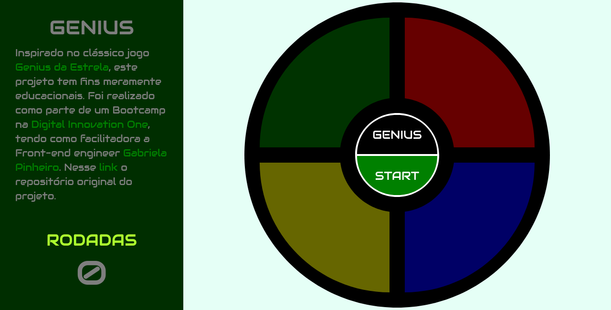

# Genius Game

## Descrição

Neste projeto o desafio foi criar um jogo inspirado no clássico jogo [Genius da Estrela](https://www.estrela.com.br/genius). Nele foi utilizado HTML, CSS e principalmente JavaScript para manipulação de elementos da DOM.

O jogo conta com sequências aleatórias e um placar que mostra a contagem das rodadas.

O projeto fins meramente educacionais práticos. Foi realizado como parte de um Bootcamp na [Digital Innovation One](https://www.dio.me/), tendo como facilitadora a Front-end engineer [Gabriela Pinheiro](href="https://www.linkedin.com/in/gabrielapinheiro129). 

Nesse [link](https://github.com/SpruceGabriela/genesis-dio) o repositório original do projeto.

## Como executar

O projeto está publicado no GitHub Pages e poderá ser acessado [neste link](https://edenpaulocruz.github.io/genius-game/).

Também poderá ser executado localmente, sendo necessário o downoload/clone do repositório e abir o arquivo index.html no navegador preferido.